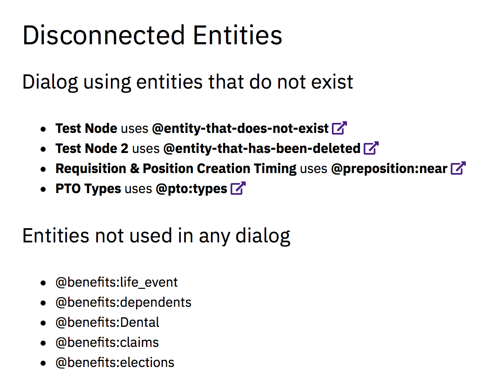

disconnected-entities.php
=========================

Designed for use with IBM’s [Watson Assistant](https://www.ibm.com/watson/ai-assistant/) (formerly IBM Watson Conversation Service).
Lists dialog nodes that use entities which do not exist, and entities that are not used by any dialog nodes.


Usage
-----

This script can be run via CLI or in a web browser over HTTP.

### Via CLI

```
$ php -f disconnected-entities.php

Disconnected Entities

Dialog using entities that do not exist:

  - "Test Node" uses @entity-that-does-not-exist in node_1_1530730964736
  - "Test Node 2" uses @entity-that-has-been-deleted in node_2_1530730992822
  - "Requisition & Position Creation Timing" uses @preposition:near in node_3_1530283715328
  - "PTO Types" uses @pto:types in node_1_1522240944046

Entities not used in any dialog:

 - @benefits:life_event
 - @benefits:dependents
 - @benefits:Dental
 - @benefits:claims
 - @benefits:elections
```

### Via HTTP




Configuration
-------------

Open `disconnected-entities.php`, locate the Configuration section, and set the following values:

- **WORKSPACE** (Usually 36 characters and looks like `1c7fbde9-102e-4164-b127-d3ffe2e58a04`)
- **USERNAME** (Usually 36 characters and looks like `febeea03-84c4-57cb-af25-5f44b7af1f05`)
- **PASSWORD** (Usually 12 characters and looks like `xCkZnpPbxLkQ`)
- **VERSION** (The ISO 8601 date of the API version, currently `2018-02-16` so you probably won’t need to change this)

You can find the Workspace ID, Username, and Password values in your Watson Assistant workspace. Click the Deploy tab, then the Credentials screen, and it should all be displayed there.

Optionally, you can also set **ASSISTANT_URL** (and uncomment the line) to enable linking directly to dialog nodes within the IBM Watson Assistant site.


Legal
-----

IBM Watson® is a registered trademark of IBM Corporation.